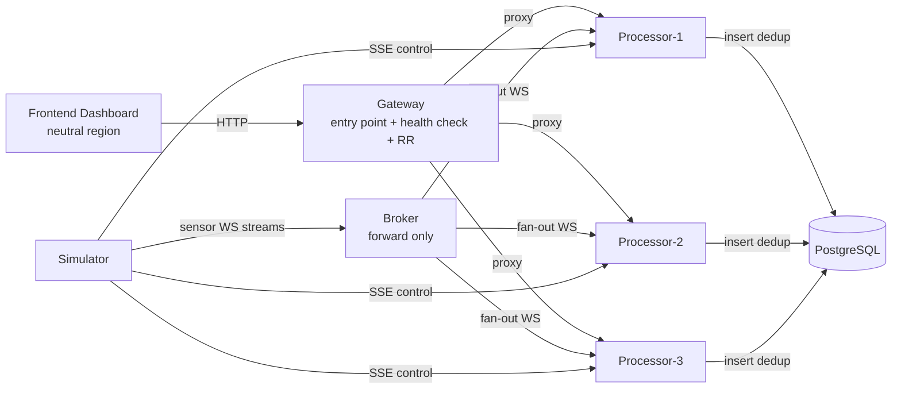

# CAMERA CAFE — Seismic Intelligence Platform

Piattaforma di monitoraggio sismico distribuita e containerizzata. Un simulatore genera stream sismici in tempo reale che vengono inoltrati da un broker a tre repliche di processore, le quali eseguono analisi FFT, classificano gli eventi (terremoto / esplosione convenzionale / evento nucleare-simile) e persistono le rilevazioni uniche su PostgreSQL. Un gateway espone un unico entrypoint API con load balancing round-robin basato su health-check, e una dashboard React mostra il tutto in tempo reale.

L'architettura rispetta un vincolo di "regione neutrale": i servizi di routing (broker, gateway, frontend) non eseguono mai analisi di intelligence, che è confinata ai servizi di elaborazione/dati (simulator, processor, PostgreSQL).

## Architettura



- **camera_cafe_neutral_region**: broker, gateway, frontend (solo routing/forwarding)
- **camera_cafe_processing_region**: simulator, processor-1/2/3, postgres (analisi FFT, classificazione, persistenza)

## Componenti

| Servizio | Ruolo | Porta | Tecnologia |
| --- | --- | --- | --- |
| `simulator` | Genera stream sensori e comandi di controllo (immagine fornita) | 8080 | `seismic-signal-simulator:multiarch_v1` |
| `broker` | Fan-out WebSocket dei dati sensore verso i processor | 9000 | Python 3.12, FastAPI, websockets, httpx |
| `processor-1/2/3` | Analisi FFT, classificazione eventi, deduplicazione, persistenza | 9001 (interna) | Python 3.12, FastAPI, NumPy, asyncpg, websockets, httpx |
| `gateway` | Entrypoint API unico, health-check + round-robin sui processor, gestione API key | 8081 | Python 3.12, FastAPI, httpx, asyncpg |
| `frontend` | Dashboard operativa SPA | 3000 (→80) | React 18, Vite, Nginx |
| `postgres` | Storage eventi rilevati e metadati gateway | 5432 | PostgreSQL |

### Classificazione eventi

I processor applicano soglie di ampiezza/SNR ed eseguono FFT su finestre scorrevoli per sensore, classificando la frequenza dominante in:

- **bassa frequenza** → terremoto (evento naturale)
- **media frequenza** → esplosione convenzionale
- **alta frequenza** → evento nucleare-simile

Gli eventi vengono deduplicati tra le repliche con una chiave deterministica prima di essere scritti su PostgreSQL.

### Resilienza

- Ogni processor ascolta lo stream di controllo SSE del simulatore e termina immediatamente su `{"command":"SHUTDOWN"}`, simulando un guasto di datacenter.
- La `restart policy` di Docker (`restart: always`) ripristina automaticamente le repliche terminate.
- Il gateway esegue health-check periodici (intervallo 1s, timeout 1.5s) e instrada in round-robin solo sulle repliche sane; in caso di errore su una richiesta esegue failover immediato e ritorna `503` solo se nessuna replica è disponibile.

## Avvio rapido

Requisiti: Docker e Docker Compose.

```bash
cd source
docker compose up --build
```

Servizi esposti sull'host:

| URL | Descrizione |
| --- | --- |
| http://localhost:3000 | Dashboard |
| http://localhost:8081 | Gateway API |
| http://localhost:9000 | Broker |
| http://localhost:8080 | Simulatore |
| localhost:5432 | PostgreSQL (`seismic` / `seismic123`) |

Per fermare e rimuovere i container:

```bash
docker compose down
```

Per rimuovere anche il volume dei dati persistiti:

```bash
docker compose down -v
```

## API principali (Gateway)

Tutte le chiamate (tranne `/health`) richiedono una API key valida, passata come header `X-API-Key` o parametro di query `api_key`.

| Metodo | Endpoint | Descrizione |
| --- | --- | --- |
| GET | `/health` | Stato del gateway e numero di repliche sane |
| GET | `/api/events` | Query storica eventi con filtri (`sensor_id`, `event_type`, `region`, `since`) e paginazione |
| GET | `/api/events/stream` | Stream SSE live degli eventi rilevati |
| GET | `/api/sensors` | Elenco sensori monitorati |
| GET | `/api/stats` | Statistiche aggregate |
| GET | `/api/replicas` | Stato di salute di ogni replica processor |
| GET | `/api/auth/me` | Informazioni sulla API key corrente |
| GET/POST/DELETE | `/api/admin/keys` | Gestione API key (ruolo admin) |
| GET | `/api/admin/audit` | Log di audit delle chiamate |

Una API key admin di bootstrap è configurata via variabile d'ambiente `BOOTSTRAP_ADMIN_KEY` in `docker-compose.yml` (solo per sviluppo/valutazione — **da cambiare in un ambiente reale**).

## Struttura del repository

```
.
├── Student_doc.md        # Specifica tecnica completa (user stories, container, endpoint, schema DB)
├── input.md               # Descrizione di sistema e user stories originali
├── booklets/               # Materiale di presentazione (mockup, slide)
└── source/                 # Codice sorgente ed infrastruttura
    ├── docker-compose.yml
    ├── broker/
    ├── gateway/
    ├── processor/
    ├── frontend/
    └── db/
```

Documentazione di riferimento più dettagliata (user stories, endpoint completi, schema del database, policy di rete) in [`Student_doc.md`](./Student_doc.md).

## Variabili d'ambiente principali

Configurate in `source/docker-compose.yml`, tra cui:

- **simulator**: `SAMPLING_RATE_HZ`, `AUTO_SHUTDOWN_ENABLED`, `AUTO_SHUTDOWN_MIN_SECONDS`, `AUTO_SHUTDOWN_MAX_SECONDS`
- **processor**: `WINDOW_SIZE`, `ANALYZE_EVERY`, `MIN_ANALYSIS_FREQ_HZ`, `AMPLITUDE_THRESHOLD`, `SNR_THRESHOLD`, `TIME_BUCKET_SECONDS`
- **gateway**: `PROCESSOR_URLS`, `HEALTH_CHECK_INTERVAL`, `HEALTH_CHECK_TIMEOUT`, `KEY_HASH_SECRET`, `BOOTSTRAP_ADMIN_KEY`

## Licenza

Da definire.
