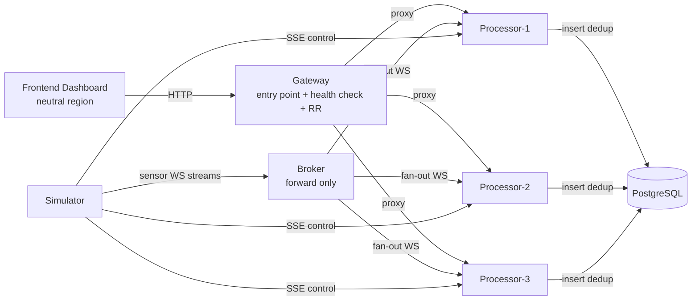

# CAMERA CAFE — Seismic Intelligence Platform

A distributed, containerized seismic monitoring platform. A simulator generates real-time seismic streams that are forwarded by a broker to three processor replicas, which run FFT analysis, classify events (earthquake / conventional explosion / nuclear-like) and persist unique detections into PostgreSQL. A gateway exposes a single API entrypoint with health-checked round-robin load balancing, and a React dashboard visualizes everything in real time.

The architecture enforces a "neutral region" constraint: routing services (broker, gateway, frontend) never perform intelligence processing, which is confined to the processing/data services (simulator, processors, PostgreSQL).

## Architecture



- **camera_cafe_neutral_region**: broker, gateway, frontend (routing/forwarding only)
- **camera_cafe_processing_region**: simulator, processor-1/2/3, postgres (FFT analysis, classification, persistence)

## Components

| Service | Role | Port | Technology |
| --- | --- | --- | --- |
| `simulator` | Generates sensor streams and control commands (provided image) | 8080 | `seismic-signal-simulator:multiarch_v1` |
| `broker` | Fans out sensor data via WebSocket to the processors | 9000 | Python 3.12, FastAPI, websockets, httpx |
| `processor-1/2/3` | FFT analysis, event classification, deduplication, persistence | 9001 (internal) | Python 3.12, FastAPI, NumPy, asyncpg, websockets, httpx |
| `gateway` | Single API entrypoint, health-check + round-robin over processors, API key management | 8081 | Python 3.12, FastAPI, httpx, asyncpg |
| `frontend` | Operator dashboard SPA | 3000 (→80) | React 18, Vite, Nginx |
| `postgres` | Storage for detected events and gateway metadata | 5432 | PostgreSQL |

### Event classification

Processors apply amplitude/SNR thresholds and run FFT over per-sensor sliding windows, classifying the dominant frequency as:

- **low frequency** → earthquake (natural event)
- **mid frequency** → conventional explosion
- **high frequency** → nuclear-like event

Events are deduplicated across replicas with a deterministic key before being written to PostgreSQL.

### Resilience

- Each processor listens to the simulator's SSE control stream and terminates immediately on `{"command":"SHUTDOWN"}`, simulating a datacenter failure.
- Docker's `restart policy` (`restart: always`) automatically recovers terminated replicas.
- The gateway runs periodic health checks (1s interval, 1.5s timeout) and routes round-robin only over healthy replicas; on a request failure it performs immediate failover and returns `503` only when no replica is available.

## Quick start

Requirements: Docker and Docker Compose.

```bash
cd source
docker compose up --build
```

Services exposed on the host:

| URL | Description |
| --- | --- |
| http://localhost:3000 | Dashboard |
| http://localhost:8081 | Gateway API |
| http://localhost:9000 | Broker |
| http://localhost:8080 | Simulator |
| localhost:5432 | PostgreSQL (`seismic` / `seismic123`) |

To stop and remove the containers:

```bash
docker compose down
```

To also remove the persisted data volume:

```bash
docker compose down -v
```

## Main API (Gateway)

All calls (except `/health`) require a valid API key, passed as the `X-API-Key` header or the `api_key` query parameter.

| Method | Endpoint | Description |
| --- | --- | --- |
| GET | `/health` | Gateway status and number of healthy replicas |
| GET | `/api/events` | Historical event query with filters (`sensor_id`, `event_type`, `region`, `since`) and pagination |
| GET | `/api/events/stream` | Live SSE stream of detected events |
| GET | `/api/sensors` | List of monitored sensors |
| GET | `/api/stats` | Aggregated statistics |
| GET | `/api/replicas` | Health status of each processor replica |
| GET | `/api/auth/me` | Information about the current API key |
| GET/POST/DELETE | `/api/admin/keys` | API key management (admin role) |
| GET | `/api/admin/audit` | Audit log of API calls |

A bootstrap admin API key is configured via the `BOOTSTRAP_ADMIN_KEY` environment variable in `docker-compose.yml` (development/evaluation only — **change it in a real environment**).

## Repository structure

```
.
├── Student_doc.md        # Full technical spec (user stories, containers, endpoints, DB schema)
├── input.md               # Original system description and user stories
├── booklets/               # Presentation material (mockups, slides)
└── source/                 # Source code and infrastructure
    ├── docker-compose.yml
    ├── broker/
    ├── gateway/
    ├── processor/
    ├── frontend/
    └── db/
```

More detailed reference documentation (user stories, full endpoint list, database schema, network policy) is in [`Student_doc.md`](./Student_doc.md).

## Main environment variables

Configured in `source/docker-compose.yml`, including:

- **simulator**: `SAMPLING_RATE_HZ`, `AUTO_SHUTDOWN_ENABLED`, `AUTO_SHUTDOWN_MIN_SECONDS`, `AUTO_SHUTDOWN_MAX_SECONDS`
- **processor**: `WINDOW_SIZE`, `ANALYZE_EVERY`, `MIN_ANALYSIS_FREQ_HZ`, `AMPLITUDE_THRESHOLD`, `SNR_THRESHOLD`, `TIME_BUCKET_SECONDS`
- **gateway**: `PROCESSOR_URLS`, `HEALTH_CHECK_INTERVAL`, `HEALTH_CHECK_TIMEOUT`, `KEY_HASH_SECRET`, `BOOTSTRAP_ADMIN_KEY`

## License

To be defined.
